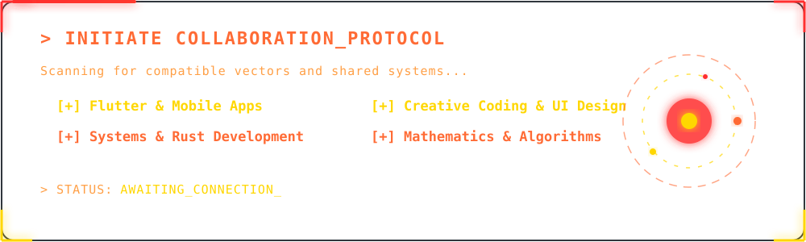

<div align="center">
  
</div>

<div align="center">
  
</div>

<div align="center">
  <a href="https://git.io/typing-svg"></a>
</div>

<div align="center">
  
</div>

<br/>

<div align="center">
  <a href="https://github.com/dis70rt"></a>&nbsp;
  <a href="https://linkedin.com/u/in-saikat"></a>&nbsp;
  <a href="https://saikat.in"></a>&nbsp;
  <a href="https://blog.saikat.in"></a>&nbsp;
  <a href="https://instagram.com/saikat._"></a>
</div>

<br/>

<div align="center">
  
</div>

## 「 About Me 」


```text
saikat@das -----------------------------------------------------------------
. OS: . . . . . . . . . . . . . . . . . . . .  Windows 11, Android 15, Linux
. Uptime: . . . . . . . . . . . . . . . . . . .  22 years, 6 months, 27 days
. Host: . . . . . . . . . . . . . . . . . . . . . . . .  IIT (BHU), Varanasi
.
. Languages.Programming:  . . . . . . . . . . . . . .  Go, Python, C++, Dart
. Languages.Real: . . . . . . . . . . . . . . . . .  English, Hindi, Bengali
.
. Hobbies.Software: . . . . . . . . . . . . . . Chess, Gaming, Movies, Anime
. Hobbies.Hardware: . . . . . . . . . Badminton, Walking, Sketching, Reading
```

<br clear="both"/>

<div align="center">
  
</div>

## 「 Technologies 」

<table border="0" cellspacing="12" cellpadding="0" align="center">
<tr>

<td width="280" valign="top" align="center">

<h3>⚡ Languages & Frontend</h3>
<br>

<table align="center" cellspacing="0" cellpadding="10">
  <tr>
    <td align="center"><br/><sub><b>Go</b></sub></td>
    <td align="center"><br/><sub><b>Python</b></sub></td>
    <td align="center"><br/><sub><b>Dart</b></sub></td>
  </tr>
  <tr>
    <td align="center"><br/><sub><b>C++</b></sub></td>
    <td align="center"><br/><sub><b>Flutter</b></sub></td>
    <td align="center"><br/><sub><b>React</b></sub></td>
  </tr>
</table>

</td>

<td width="280" valign="top" align="center">

<h3>🔥 Backend & DBs</h3>
<br>

<table align="center" cellspacing="0" cellpadding="10">
  <tr>
    <td align="center"><br/><sub><b>PostgreSQL</b></sub></td>
    <td align="center"><br/><sub><b>Redis</b></sub></td>
    <td align="center"><br/><sub><b>Kafka</b></sub></td>
  </tr>
  <tr>
    <td align="center"><br/><sub><b>FastAPI</b></sub></td>
    <td align="center"><br/><sub><b>gRPC</b></sub></td>
    <td align="center"><br/><sub><b>Microservices</b></sub></td>
  </tr>
</table>

</td>

<td width="280" valign="top" align="center">

<h3>☁️ DevOps & AI</h3>
<br>

<table align="center" cellspacing="0" cellpadding="10">
  <tr>
    <td align="center"><br/><sub><b>Docker</b></sub></td>
    <td align="center"><br/><sub><b>Linux</b></sub></td>
    <td align="center"><br/><sub><b>Git</b></sub></td>
  </tr>
  <tr>
    <td align="center"><br/><sub><b>OCR Pipelines</b></sub></td>
    <td align="center"><br/><sub><b>Document AI</b></sub></td>
    <td align="center"><br/><sub><b>CV</b></sub></td>
  </tr>
</table>

</td>

</tr>
</table>

<div align="center">
  
</div>

## 「 Featured Projects 」

<table width="100%" border="0" cellspacing="12" cellpadding="10">
<tr>
  <td width="50%" valign="top">
    <h3>⚡ <a href="https://github.com/dis70rt/TradeOrders">TradeOrders</a></h3>
    <p><b>Ultra-fast order matching engine</b><br>
    <i>Go, Kafka, PostgreSQL, Redis, Docker</i></p>
    <blockquote>18.2k req/sec • Event-driven matching engine</blockquote>
  </td>
  <td width="50%" valign="top">
    <h3>🎵 <a href="https://github.com/dis70rt/Bluppi">Bluppi</a></h3>
    <p><b>Real-time synchronized music streaming</b><br>
    <i>Go, Flutter, gRPC, Redis, PostgreSQL, Solr</i></p>
    <blockquote>51k+ concurrent connections</blockquote>
  </td>
</tr>
</table>

<div align="center">
  
</div>

## 「 Writing & Engineering Blogs 」

I actively write about backend architecture, performance tuning, and technical deep-dives on [blog.saikat.in](https://blog.saikat.in):

<!-- BLOG-POST-LIST:START -->
- [+] [I Had No Idea What an Order Book Was. Now I've Built One That Handles 18k RPS.](https://blog.saikat.in/i-had-no-idea-what-an-order-book-was-now-i-ve-built-one-that-handles-18k-rps)
- [+] [Beyond the Green Dot: Engineering Online Presence using GoLang](https://blog.saikat.in/beyond-the-green-dot-engineering-online-presence-using-golang)
- [+] [How I Got gRPC Working Through Cloudflare Tunnel (The Hard Way)](https://blog.saikat.in/how-i-got-grpc-working-through-cloudflare-tunnel-the-hard-way)
- [+] [Firebase Draining Your Wallet? Here's How to Stop Paying for Every Single Read.](https://blog.saikat.in/firebase-draining-your-wallet-here-s-how-to-stop-paying-for-every-single-read)
<!-- BLOG-POST-LIST:END -->

<div align="center">
  
</div>

## 「 GitHub Stats 」

<div align="center">
  <a href="https://git.io/streak-stats">
    
  </a>
</div>

<br/>

<div align="center">
  
</div>

<div align="center">
  
</div>

<div align="center">
  <a href="./docs/COLLAB.md"></a>
</div>

<br/>

<div align="center">
  <a href="https://saikat.in"></a>&nbsp;&nbsp;
  <a href="https://linkedin.com/u/in-saikat"></a>
</div>

<div align="center">
  
</div>
