<div align="center">
  
</div>

<div align="center">
  <a href="https://git.io/typing-svg"></a>
</div>

<div align="center">
  
</div>

<br/>

<div align="center">
  <a href="https://linkedin.com/u/in-saikat"></a>&nbsp;
  <a href="https://saikat.in"></a>
</div>

<br/>

<div align="center">
  
</div>

## 「 About Me 」

```javascript
const saikat = {
    alias:    "dis70rt",
    role:     "Computer Science Student at IIT BHU",
    focus:    ["Computer Science", "Technology", "Mathematics"],
    learning: ["Flutter", "Rust"],
    interests:["Creative Coding", "Mathematics"],
    goal:     "Never stop creating new ideas 🚀"
};
```

- 👨‍💻 Passionate about **Computer Science and Technology**
- 📏 Captivated by the beautiful world of **Mathematics**
- 🌱 Currently learning **Flutter & Rust**
- 💡 Interested in **Creative Coding & Mathematics**

<br clear="both"/>

<div align="center">
  
</div>

## 「 Technologies 」

<table border="0" cellspacing="12" cellpadding="0" align="center">
<tr>

<td width="420" valign="top" align="center">

<h3>⚡ Languages</h3>
<br>

<table align="center" cellspacing="0" cellpadding="10">
  <tr>
    <td align="center"><br/><sub><b>Python</b></sub></td>
    <td align="center"><br/><sub><b>Dart</b></sub></td>
    <td align="center"><br/><sub><b>Rust</b></sub></td>
    <td align="center"><br/><sub><b>C++</b></sub></td>
  </tr>
  <tr>
    <td align="center"><br/><sub><b>C</b></sub></td>
    <td align="center"><br/><sub><b>HTML5</b></sub></td>
    <td align="center"><br/><sub><b>CSS3</b></sub></td>
    <td align="center"><br/><sub><b>SQL</b></sub></td>
  </tr>
</table>

</td>

<td width="420" valign="top" align="center">

<h3>🔥 Frameworks &amp; Tools</h3>
<br>

<table align="center" cellspacing="0" cellpadding="10">
  <tr>
    <td align="center"><br/><sub><b>Flutter</b></sub></td>
    <td align="center"><br/><sub><b>React</b></sub></td>
    <td align="center"><br/><sub><b>Node.js</b></sub></td>
    <td align="center"><br/><sub><b>Android</b></sub></td>
  </tr>
  <tr>
    <td align="center"><br/><sub><b>MongoDB</b></sub></td>
    <td align="center"><br/><sub><b>Firebase</b></sub></td>
    <td align="center"><br/><sub><b>Docker</b></sub></td>
    <td align="center"><br/><sub><b>Git</b></sub></td>
  </tr>
</table>

</td>

</tr>
</table>

<div align="center">
  
</div>

## 「 Portfolio Showcase 」

<table width="100%" border="0" cellspacing="12" cellpadding="0">
<tr>
  <td width="33.3%" valign="top" align="center"><a href="https://github.com/dis70rt?tab=repositories"></a></td>
  <td width="33.3%" valign="top" align="center"><a href="https://saikat.in"></a></td>
  <td width="33.3%" valign="top" align="center"><a href="https://saikat.in"></a></td>
</tr>
</table>

<div align="center">
  
</div>

## 「 GitHub Stats 」

<div align="center">
  
</div>

<br/>

<div align="center">
  
</div>

<div align="center">
  
</div>

<div align="center">
  <a href="./docs/COLLAB.md"></a>
</div>

<br/>

<div align="center">
  <a href="https://saikat.in"></a>&nbsp;&nbsp;
  <a href="https://linkedin.com/u/in-saikat"></a>
</div>

<div align="center">
  
</div>
